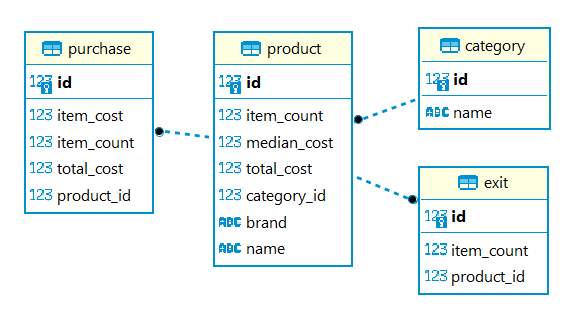
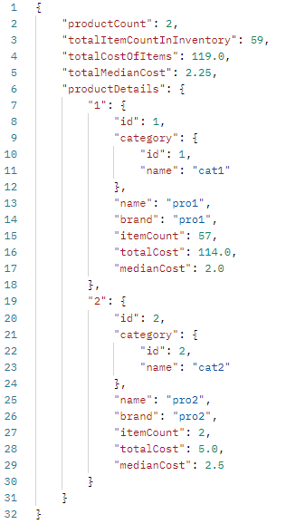

# inventory-management
Bu uygulama temel bir envanter yönetim sistemidir.
## Docker Entegrasyonu
Uygulama Spring 3.1 ile gelen "spring-boot-docker-compose" entegrasyonunu kullanmaktadır. 
Yani geliştiricilerin hiç bir şekilde uygulamayı çalıştırmak için "docker build" gibi komutları kullanmalarına
gerek yoktur. Uygulama başlatıldığında Spring "compose.yaml" dosyasını kullanır ve gerekli bağımlılıkları 
bilgisayara indirir. (Bu işlemler için uygulamayı Docker kurulu bir makinede çalıştırmalısınız.)
## Kurulum
GitHub reposunu bilgisayarınıza indirdikten sonra proje için kullanılacak Java versiyonunu 17 olarak belirleyin. Ardından 
"mvn clean" ve "mvn test" komutlarını koşarak kodun derlenebildiğinden emin olun. Kullanıdığınız IDE' de başlangıç 
sınıfı "InventoryManagementApplication" olacak şekilde ayarlarınızı yapın ve uygulamayı başlatın. Eğer bilgisayarınızda
"postgres" in "16" versiyonuna ait Docker imajı yoksa Spring indirecektir (biraz zaman alabilir). Uygulama kullanıma hazır.
## Postgres Bilgileri
Uygulama ilişkisel veritabanı olarak Postgres kullanıyor. Bağlantı bilgileri şu şekilde:
```
jdbc:postgresql://localhost:4832/inventory
Database Name:inventory
Postgres Port:4832
User Name :myuser
Password :secret
```
## Örnek İstekler
Proje içerisinde Postman koleksiyonu bulunuyor. Kendi Postman uygulamanız üzerinden istekleri deneyebilirsiniz.
[inventory-management.postman_collection.json](inventory-management.postman_collection.json)
## Authentication
Uygulama "Basic Authentication" ile çalışır. Kullanıcı bilgilerinin her bir istek içerisinde gönderilmesi gereklidir.
```
username:user
password:password
```
## ER Diyagramı
Uygulama başlamasıyla birlikte bir kaç veriyi otomatik olarak veritabanına ekleyecektir. Bu sayede özet web 
servisini kullandığınızda mantıksız veriler görmeniz engellenir. (Bunu engellemek için "init-data" özelliğini 
"false" yapabilirsiniz.)
Uygulamanın akışı içerisinde kullanılan tablolarak ait ER diyagramı:



Buradaki tabloların işlevleri:
- Category: İsterler arasında olduğu için eklenmiştir. "Product" tablosuyla "1-N" ilişkiye sahiptir.
- Product: Envanter içerisinde saklanacak olan bileşenlerin her biri için birer kayıt burada oluşturulur. 
Üründen envanterde kaç tane olduğu, ortalama maliyeti gibi bilgileri saklar.
- Purchase: "Product" tablosunda tanımı yapılan ürünler için adet ve maliyet bazlı olarak envantere girişlerin saklanacağı tablodur.
- Exit: "Product" tablosunda tanımı yapılan ürünler için adet bazlı olarak envanterden yapılan çıkışların saklanacağı tablodur.
## Web Servisler

### Category Web Servisleri
```
- localhost:8080/category (POST): yeni bir kategori eklemeyi sağlar
- localhost:8080/category (PUT): var olan bir kategoriyi düzenlemeyi sağlar
- localhost:8080/category (GET): var olan tüm kategorileri görmenizi sağlar
- localhost:8080/category?id=1 (GET): belitilen id numarasına sahip kategori kaydını döner
```
### Product Web Servisleri
```
- localhost:8080/product (POST): yeni bir ürün eklemeyi sağlar
- localhost:8080/product (PUT): var olan bir ürünü düzenlemeyi sağlar
- localhost:8080/product (GET): var olan tüm ürünleri görmenizi sağlar
- localhost:8080/product?id=1 (GET): belitilen id numarasına sahip ürün kaydını döner
```
### Purchase Web Servisleri
```
- localhost:8080/purchase (POST): envantere yeni bir giriş yapmayı sağlar
- localhost:8080/purchase (PUT): zaten yapılmış olan envanter girişini düzenlemeyi sağlar
- localhost:8080/purchase (GET): var olan tüm envanter girişlerini görmenizi sağlar
- localhost:8080/purchase?id=1 (GET): belitilen id numarasına sahip envanter girişini döner
```
### Exit Web Servisleri
```
- localhost:8080/exit (POST): envanterden ürün çıkışı yapmayı sağlar
- localhost:8080/exit (PUT): zaten yapılmış olan envanter çıkışını düzenlemeyi sağlar
- localhost:8080/exit (GET): var olan tüm envanter çıkışlarını görmenizi sağlar
- localhost:8080/exit?id=1 (GET): belitilen id numarasına sahip envanter çıkışını döner
```
### Summary Web Servisi
```
- localhost:8080/inventory/summary (GET): envanterin o anki durumu hakkında genel bilgi verir.
```
- productCount: "Product" tablosunda bulunan toplam ürün tipi sayısını verir.
- totalItemCountInInventory: Envanter içerisindeki tüm ürün sayılarının toplamını verir.
- totalCostOfItems: Envanterin toplanması sırasında oluşan maliyeti gösterir.
- totalMedianCost: Envanterin toplanması sırasında oluşan ürün başına ortalama maliyeti gösterir.
- productDetails: Her bir ürüne ait sayı, toplam maliyet, ortalama maliyet bilgilerini verir.

